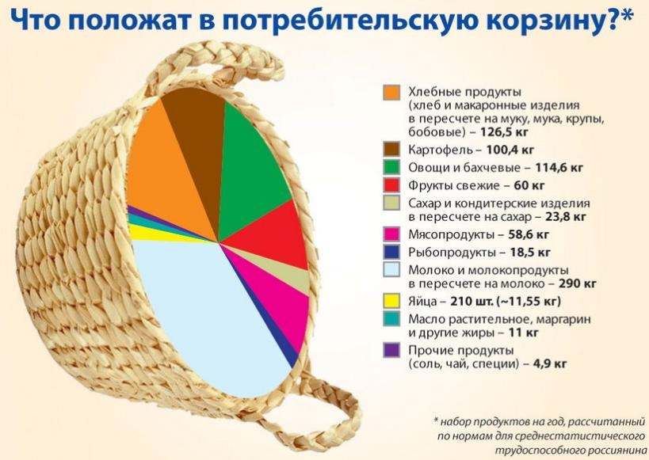
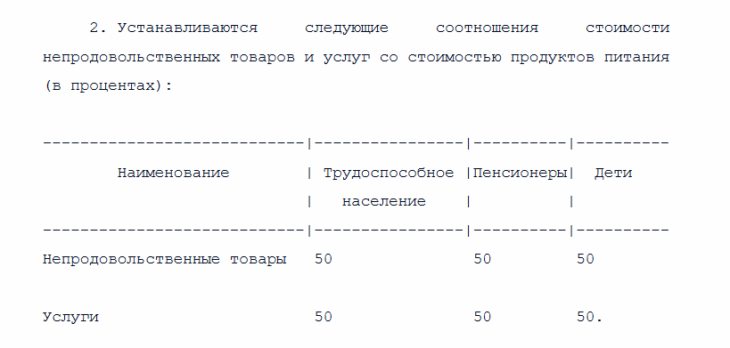

## Проект посвященный исследованию зависимости стоимости продуктовой корзины от параметров человека.

# Обученная модель способна предсказывать разницу между официальными данными и реальной суммой трат на продукты из необходимого набора продуктовой корзины

Проведя опрос среди моих знакомых, мне удалось выявить собрать разношерстный набор данных, в котором есть такие признаки: пол, возраст, зарплата, город проживания, образ жизни, а также (самое главное) количество потребляемых продуктов в неделю. 
Благодаря открытым источникам мне удалось выяснить, какова разница между тем, как правительство рекомендует нам питаться, и сколько реально тот или иной человек потребляет продуктов. Соответственно, удалось сопоставить суммы этих продуктовых наборов на неделю.

#Обучение модели
Спустя время, отведенное на сбор данных опроса, настал момент собирать их в кучу и высчитывать стоимость продуктов на неделю для каждого участника опроса. В конечном итоге моя таблица имела всего 6 столбцов: разница между официальными тратами на продукты и реальной суммой, а также 5 параметров человека (всё те же пол, возраст и т.д.)
Обученная мною модель способна прогнозировать вот эту целевую переменную (разницу в суммах), исходя из ряда параметров о человеке.

Исходя из этих данных (зарисовка не моя, но тут как раз всё то, что прописано в Федеральный закон от 03.12.2012 г. № 227-ФЗ
О потребительской корзине в целом по Российской Федерации)
http://www.kremlin.ru/acts/bank/36428
Данные о необходимых нормах продуктов на год на трудоспособного человека взяты из ФЗ о потребительской корзине №227. (пусть он и утратил силу в 2021 году, люди с того момента не стали кардинально по-новому питаться, им нужны всё те же привычные продукты, что и 13 лет назад, когда этот закон вступал в силу)

Официальные данные прожиточного минимума брал из открытых источников. (https://www.consultant.ru/document/cons_doc_LAW_407365/)

По данным из интернета, прожиточный минимум как раз равен потребительской корзине.

 
Это всё тот же ФЗ №227

Получается, что 50% от з.п. человека должны уходить на непродовольственные товары и услуги. То есть, зарабатывая 40000р/мес, человек должен тратить на продукты не больше 20000р/мес. Получается, что полный состав потребительской корзины на человека можно высчитать по формуле: сумма необходимых трат на продукты питания исходя из фактов о человеке * 2 = сумма потребительской корзины

Поскольку прожиточный минимум как раз включает в себя необходимые для жизни блага, то мы его можем приравнять к составу потребительской корзины. 
Тогда получается, что Прожиточный минимум = 2 * продуктовая корзина
Тогда по Москве продуктовая корзина = Прожиточный минимум / 2 = 27302 / 2 = 13651

Я посчитал среднюю величину прожиточного минимума во всех остальных субъектах РФ, взяв данные из официальных постановлений регионов и городов адм. назначения для трудоспособного населения, а затем посчитал их мат. ожидание. Оно составило 18459. Тогда сумма продуктовой корзины 9230.

В среднем цена продуктов в Москве, в сравнение с регионами, на 30% выше. 
Если человек любит какой-то продукт и часто его потребляет, то скорее всего он в нём разбирается, а значит будет покупать более качественный (и скорее всего более дорогой товар), исходя из отношения товара из среднего ценового диапазона с самым дешевым товаром, было принято решение увеличить траты на излюбленный товар для каждого потребителя на 40%.

# В итоге мы имеем модель, которая предсказывает разницу между оф. значениями и между реальной стоимостью продуктовой корзины на месяц.

# В целом, эту модель можно также использовать как предсказание того, сколько денег Вам нужно выделять на продукты в неделю. 